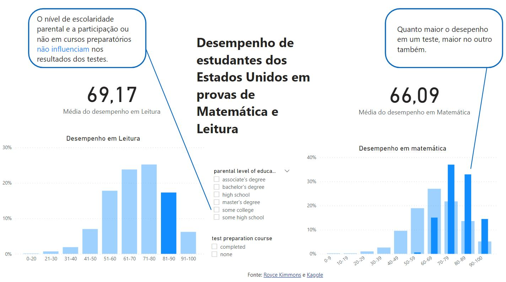

# Dashboard de desempenho
Dashboard simples desenvolvido com Power BI analisando o desempenho de estudantes dos Estados Unidos em provas de Leitura e Matemática.

Dados disponíveis no [Kaggle](https://www.kaggle.com/spscientist/students-performance-in-exams). O arquivo "Fonte dos dados" possui o link para o dataset do Kaggle e para a fonte original.

## Resultado da análise
Dashboard com o resultado da análise dos dados:

Não publiquei o Dashboard por não possuir uma conta paga do Power BI.
